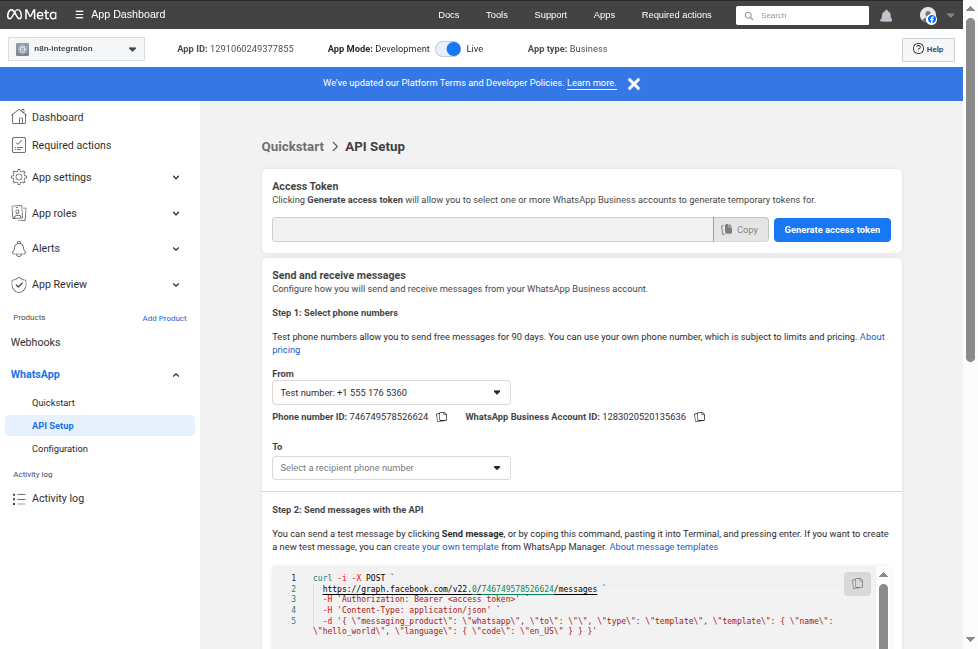
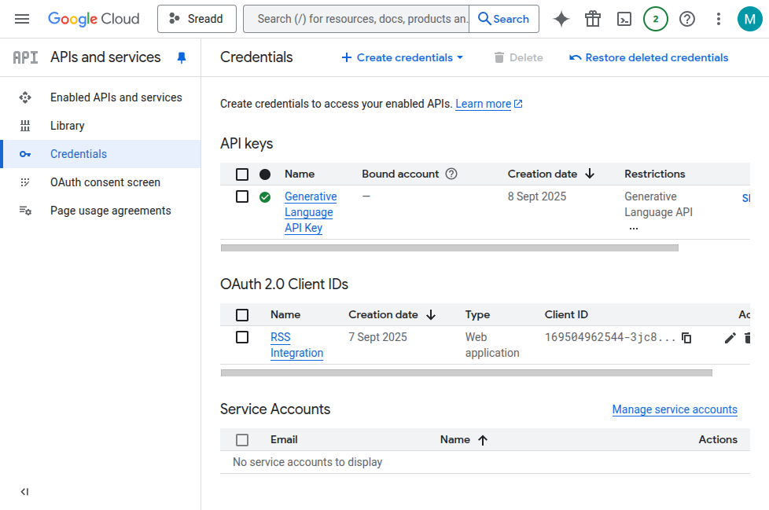
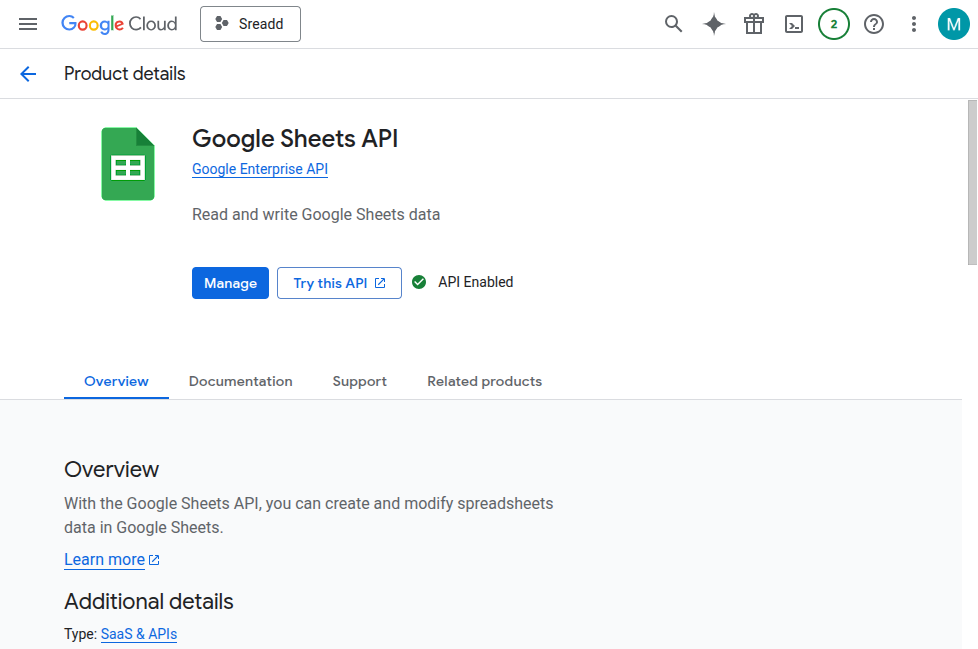
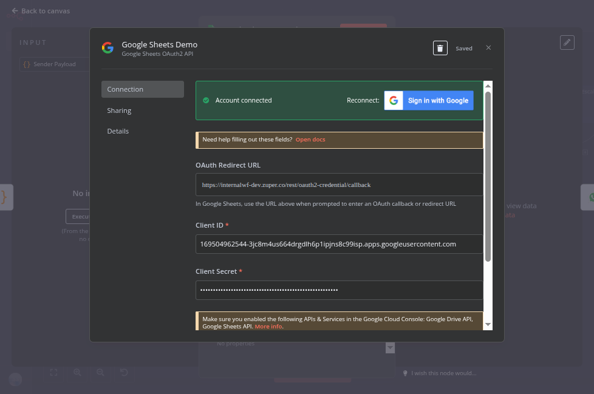
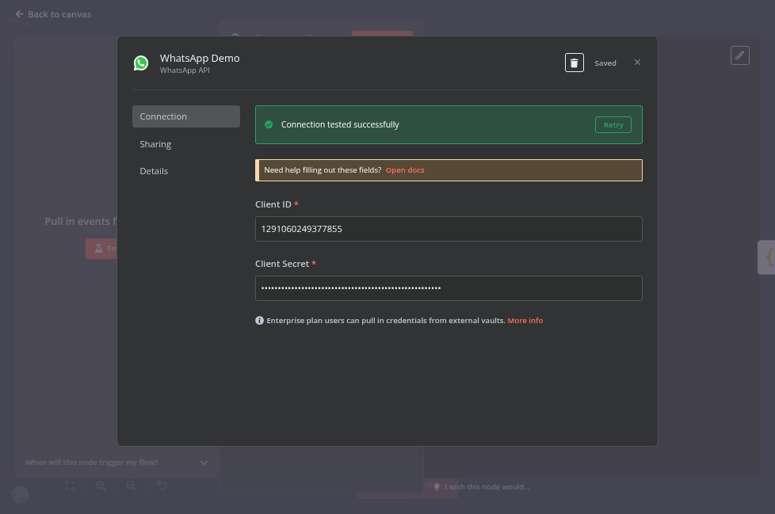
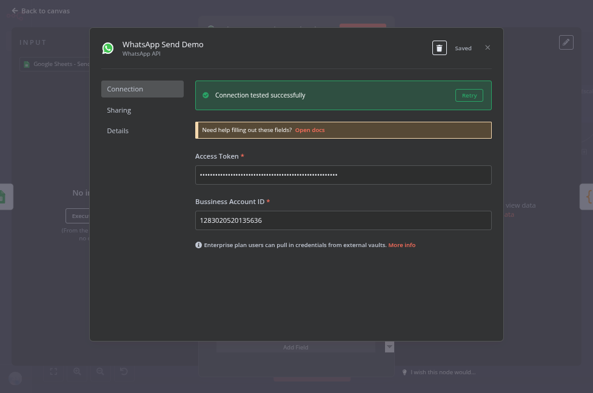
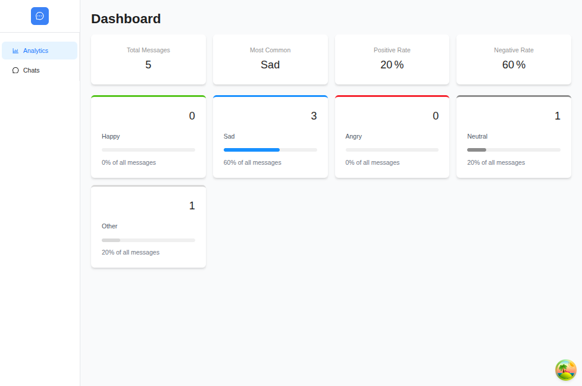
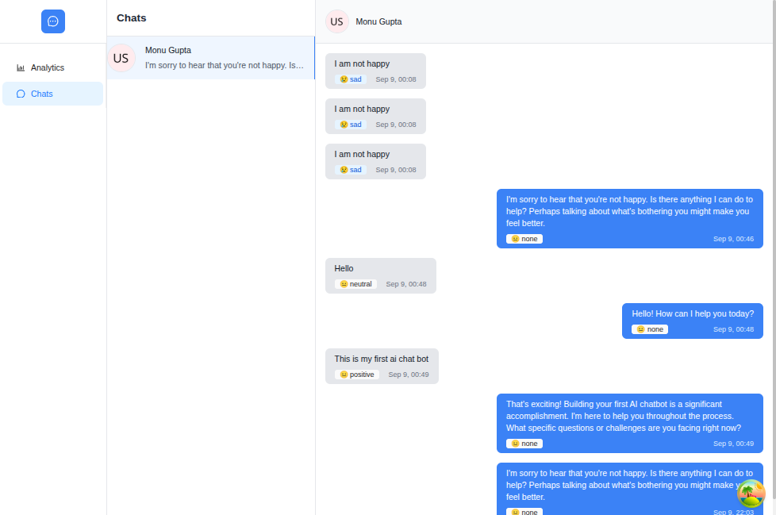
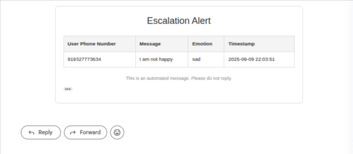
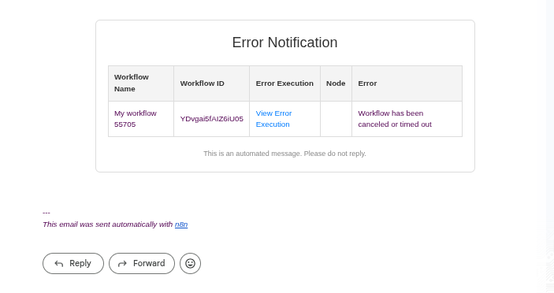

# WhatsApp Message Capture, Analysis & Dashboard

This project integrates **Meta WhatsApp Cloud API**, **n8n Automation Workflows**, and a **React Dashboard** to capture incoming WhatsApp messages, store them in Google Sheets, and display/analyze them in a React web application.  

---

## 🚀 Features

- WhatsApp Business Cloud API integration (free for dev).
- [Getting Started](https://developers.facebook.com/docs/whatsapp/cloud-api/get-started)
- [Webhook Setup](https://developers.facebook.com/docs/whatsapp/cloud-api/guides/set-up-whatsapp-echo-bot)
- 
- Automatic capture of all incoming WhatsApp messages.
- Messages stored in **Google Sheets** for tracking and analytics.
- [Google Console](https://console.cloud.google.com/)
- 
- 
- React dashboard to view and analyze messages.
- Easy setup with **n8n** for automation.
- 
- 
- 
---

## 📂 Tech Stack

- **WhatsApp Cloud API (Meta)** for receiving/sending WhatsApp messages.  
- **n8n** for workflow automation (Webhook trigger, Google Sheets integration).  
- **Google Sheets API** for storing & fetching message data.  
- **React** frontend app for viewing and analyzing messages.  

---

## 🔧 Setup Instructions

### 1. Create a Meta Developer Account & Business App
1. Setup and fill the .env values that includes n8n webhook api link
2. Go to [Meta for Developers](https://developers.facebook.com/).  
3. Create a **Developer Account**.  
4. Create a **Business App** of type `Business`.  
5. Add the **WhatsApp Product** in your app.

---

### 2. Generate WhatsApp API Token & Register Test Numbers
1. In your **Meta Developer App Dashboard**, navigate to **WhatsApp > Getting Started**.  
2. Copy:
   - `Phone Number ID`
   - `WhatsApp Business Account ID`
   - `Temporary Access Token` (valid for 24 hrs for dev)
3. Use the provided **test number** or add your own verified number.

---

### 3. Configure WhatsApp Credentials in n8n
1. Open your **n8n** instance.  
2. Go to **Credentials** > Create **WhatsApp API Credentials**:
   - Phone Number ID
   - Access Token
3. Create:
   - **Webhook Trigger Node** → To receive messages.
   - **HTTP Request Node** → To send replies.

---

### 4. Generate Google API Credentials
1. Go to [Google Cloud Console](https://console.cloud.google.com/).  
2. Create a new project.  
3. Navigate to **APIs & Services > Credentials**.  
4. Click **Create Credentials** → Select **Service Account Key**.  
5. Download the JSON credentials file.

---

### 5. Enable Google Sheets API
1. In the same project, go to **APIs & Services > Library**.  
2. Search for **Google Sheets API**.  
3. Click **Enable**.

---

### 6. Configure Google Credentials in n8n
1. In **n8n**, go to **Credentials** → **Google Sheets OAuth2 API**.  
2. Upload the JSON credentials or configure OAuth with:
   - `Client ID`
   - `Client Secret`
3. Create nodes in your workflow:
   - **Google Sheets Node (Append Row)** to store messages.
   - **Google Sheets Node (Get Rows)** to fetch message records.

---

### 7. Install React Project Dependencies
```bash
npm install --legacy-peer-deps
```

### 8. Run the React App
```bash
npm run dev
```
### 9. How It Works
When a message is sent to any registered WhatsApp test number:
1. n8n Webhook captures the message.
2. The message is logged in Google Sheets.
3. The React app fetches and displays this data for analysis.



